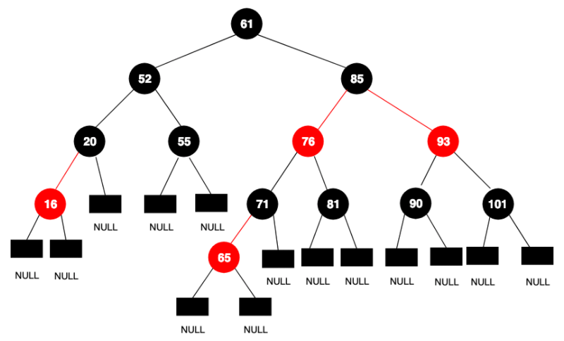
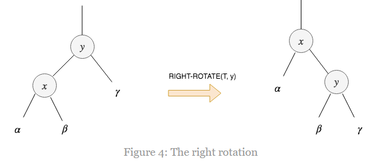
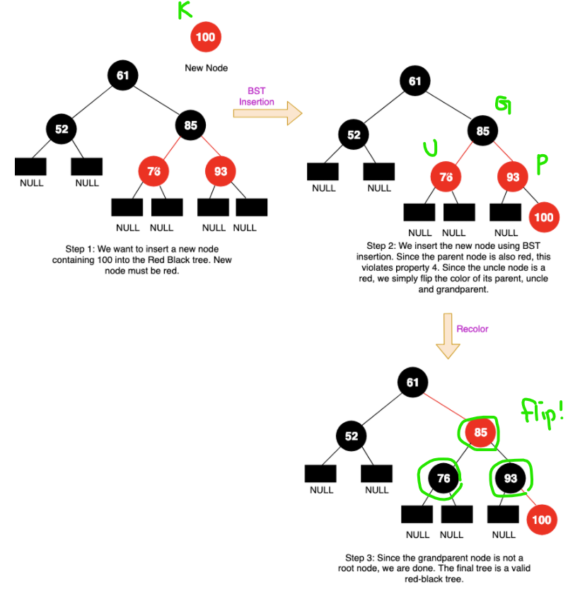
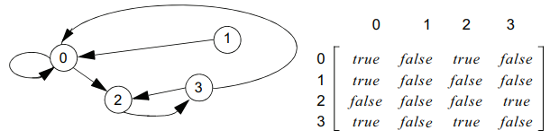
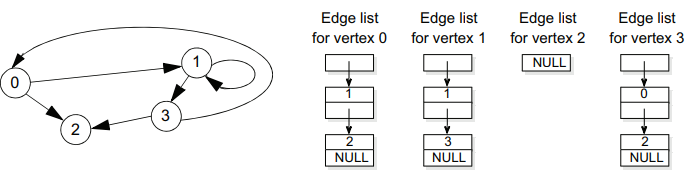

# DataStructure
C++로 구현해보는 자료구조🤠

- [DataStructure](#datastructure)
  - [Trees](#trees)
    - [Binary Search Trees](#binary-search-trees)
  - [Balanced Trees](#balanced-trees)
    - [Heap](#heap)
    - [B-Trees](#b-trees)
    - [Red-Black Tree](#red-black-tree)
      - [Insertion](#insertion)
      - [Deletion](#deletion)
    - [AVL Tree](#avl-tree)
  - [Graph](#graph)
    - [Graph Implementations](#graph-implementations)
      - [Adjacency Matrix](#adjacency-matrix)
      - [Linked List](#linked-list)
      - [Set](#set)
    - [Graph Traversals](#graph-traversals)
      - [DFS(using a stack)](#dfsusing-a-stack)
      - [BFS(using a queue)](#bfsusing-a-queue)
    - [Path Algorithn](#path-algorithn)
  - [Hash](#hash)

## Trees
### Binary Search Trees
- 이진 탐색 트리 저장 규칙
  - 규칙 1. 
    특정 노드의 Entry값은 그 노드의 왼쪽 서브 트리의 모든 값들 보다 크거나 같다.
  - 규칙 2. 
    특정 노드의 Entry값은 그 노드의 오른쪽 서브 트리의 모든 값들 보다 작다.

- 이진 탐색 트리를 활용한 Bag 클래스 구현 
  [해당 페이지 참조](https://github.com/junhaeng90/DataStructure/tree/main/Bag/bag6.h)
 

## Balanced Trees
### Heap
Heap은 strict weak ordering의 less-than 연산자(<)를 통해 비교가 가능한 노드들로 이루어진 이진 트리이며, 아래 2가지 규칙을 따른다.
- 규칙 1. 
  특정 노드의 Entry 값은 자식 노드의 Entry 값보다는 항상 크다.
- 규칙 2. 
  Heap은 완전 이진 트리이며, 그렇기 때문에 가장 깊은 레벨을 제외한 모든 레벨은 가능한 많은 노드를 포함하고 있어야한다.
  그리고 가장 깊은 레벨에서 노드들은 왼쪽에서부터 채워져 나간다.

> strict weak ordering 이란?  
> 어떤 이항연산 R에 대해서, 다음의 4가지 조건을 만족하면 strict weak ordering을 만족하는 관계라고 할 수 있다.  
> 1. 비반사성(irreflexivity): 모든 x에 대해 R(x, x)는 거짓
> 2. 비대칭성(asymmetry): 모든 x, y에 대해 R(x, y)가 참이면 R(y, x)는 거짓
> 3. 추이성(transitivity): 모든 x, y, z에 대해 R(x, y)와 R(y, z)가 참이면 R(x, z)는 참
> 4. 비비교성의 추이성(transitivity of incomparability): 모든 x, y, z에 대해 R(x, y)와 R(y, x)가 거짓이고 R(y, z)와 R(z, y)가 거짓이면 R(x, z)와 R(z, x)는 거짓
 

### B-Trees
B-tree는 Unbalanced Tree 문제를 해결하기 위한 하나의 방안이며 이진 트리와 비슷하지만 *2개 이상의 자식 노드를 가질 수 있다*는 점과 각각의 *노드가 한 개 이상의 Entry를 가질 수 있다*는데 차이가 있다.

- B-tree 규칙
  - 규칙 1. 
    루트에는 Entry가 하나 이상 있을 수 있으며(자식 노드가 없는 경우에는 Entry가 없을 수도 있음), 루트를 제외한 다른 모든 노드는 최소 MINIMIM개의 Entry를 갖는다.

  - 규칙 2. 
    노드가 가질 수 있는 최대 Entry 개수는 MINIMUM의 2배이다.

  - 규칙 3. 
    각각의 노드에 있는 Entry들은 작은 값에서부터 큰값으로 정렬된 배열에 저장된다.

  - 규칙 4. 
    leaf가 아닌 노드의 subtree 개수는 현재 노드가 가진 Entry의 개수보다 한 개 더 많다.

  - 규칙 5. 
    leaf가 아닌 모든 노드에 대하여 (a) 인덱스가 i인 Entry는 해당 노드의 i 번째 subtree의 모든 Entry보다 크고, i+1 번째 subtree의 모든 Entry보다 작다.

  - 규칙 6. 
    모든 leaf 노드의 depth는 동일하다.

- B-tree를 활용한 Set 클래스 구현 
  [해당 페이지 참조](https://github.com/junhaeng90/DataStructure/tree/main/BalancedTrees/set.h)

### Red-Black Tree
Red-Black Tree는 아래 5가지 추가적인 특징을 갖는 Binary Search Tree이다.
 - 특성1. 모든 노드는 red거나 black이다.
 - 특성2. root 노드는 black이다.
 - 특성3. 모든 null 노드는 black이다.(여기서 null 노드란 leaf 노드이며 어떠한 key도 가지고 있지 않은 노드이다. 우리가 red-black tree에 존재하지 않는 키를 찾으려고 할 때, null 노드에 도달하게 된다.)
 - 특성4. 만약 노드가 red라면, 두 자식 노드들은 모두 black이다. 이것은 path위에있는 어떠한 2개의 노드도 둘 다 red 노드가 될 수 없다는 것을 의미한다.
 - 특성5. root에서 null 노드까지의 모든 path는 동일한 개수의 black 노드를 갖는다.

red-black tree의 삽입과 삭제 과정에서 위의 조건들이 지켜지지않는 경우가 발생할 수 있는데, 이때는 아래 3가지 방식을 사용하여 red-black tree의 구조를 적절히 변경하여 조건을 만족할 수 있도록 유지해야한다.
  - Left-Rotation  
    
  - Right-Rotation  
    
  - Recolor

 

삽입과 삭제를 제외한 모든 연산은 일반적인 이진 탐색 트리와 정확히 동일하다. red-black 트리의 모든 연산은 **O(logn)**의 시간복잡도를 갖는다.
> All the operations except insertion and deletion are exactly the same as the operations in the ordinary binary search tree. All the operations in a red-black tree take O(logn) to run.

<bt>

#### Insertion
노드 K를 red-black 트리 T에 삽입하는 과정
1) 일반적인 이진 탐색 트리와 동일한 삽입 과정을 수행
2) 노드 K의 색깔은 red
3) red-black 트리 특성 위반 여부를 확인. 위반한다면 수정

 

case 1. red-black 트리 T가 비어있는 경우
red-black 트리 T가 비어있는 경우에는 노드 K를 red-black 트리 T의 root로 만들고 색깔은 black으로 한다.

case 2. 부모 노드 P의 색깔이 black인 경우
노드 K의 부모 노드 P의 색깔이 black인 경우에는 red-black 트리의 특성을 위반하지 않기때문에 더이상 해줄게 없다.

case 3. 부모 노드 P의 색깔이 red인 경우
부모 노드 P의 색깔이 red인 경우는 특성 4번을 위반(부모와 자식의 색깔이 둘다 red이므로)하게 된다. 삽입 연산 전의 red-black 트리는 반드시 유효해야하기때문에 조부모 노드 G의 색깔은 반드시 black(조부모 노드 G의 색깔이 red라면 두 자식 노드 모두 black이어야 하므로)이어야 한다. 해당 케이스를 해결하기 위해서는 노드 K의 삼촌 노드 U가 red인지 black인지 확인해봐야한다.

case 3-1. 부모 노드 P가 red이고 삼촌 노드 U가 red인 경우
해당 경우에는 부모 노드 P, 삼촌 노드 U, 조부모 노드 G의 색깔을 뒤집어야 한다. 즉, 부모 노드 P는 black, 삼촌 노드 U는 black, 조부모 노드 G는 red가 된다.  
  
해당 경우에 주의해야할 점은 조부모 노드 G가 red-black 트리 T의 root인 경우이다. 조부모 노드 G가 root인 경우에는 특성 2번에 의해 색깔 뒤집기가 불가능하다.

case 3-2. 부모 노드 P가 red이고 삼촌 노드 U가 black 또는 null인 경우

case 3-2-1. 부모 노드 P가 조부모 노드 G의 오른쪽 자식 노드이고 노드 K가 부모 노드 P의 오른쪽 자식 노드인 경우

case 3-2-2. 부모 노드 P가 조부모 노드 G의 오른쪽 자식 노드이고 노드 K가 부모 노드 P의 왼쪽 자식 노드인 경우

case 3-2-3. 부모 노드 P가 조부모 노드 G의 왼쪽 자식 노드이고 노드 K가 부모 노드 P의 왼쪽 자식 노드인 경우

case 3-2-4. 부모 노드 P가 조부모 노드 G의 왼쪽 자식 노드이고 노드 K가 부모 노드 P의 오른쪽 자식 노드인 경우

#### Deletion

 

### AVL Tree

 

## Graph

### Graph Implementations
#### Adjacency Matrix

인접 행렬은 그래프의 edge들을 true/false라는 값으로 표현하는 정사각형의 격자이다. 만약 그래프가 n개의 vertex들을 포함하고 있다면, 이 인접행렬은 n개의 열과 행을 갖는다. i와 j 2개의 vertex에 대해 vertext i에서 vertex j로 가는 edge가 존재한다면 (i, j) 항목의 값이 true이고, 그렇지 않다면 false이다. 

#### Linked List

#### Set

### Graph Traversals

#### DFS(using a stack)
[해당 페이지 참조](https://github.com/junhaeng90/DataStructure/tree/main/Graph/graphtraversal.h)

#### BFS(using a queue)
[해당 페이지 참조](https://github.com/junhaeng90/DataStructure/tree/main/Graph/graphtraversal.h)

### Path Algorithn

 

## Hash
어떠한 정보를 저장하는 공간이 있다고 가정해보자. 그리고 이 공간에는 고유한 key값을 갖는 레코드들이 저장된다고 하자. 각각의 레코드들은 일정 크기의 공간을 할당받고, 이 공간을 인덱스값으로 구분한다. 레코드의 key값을 통해 각각의 저장 공간 인덱스를 찾아가는 것을 hashing한다라고 말하며 이때 key값과 인덱스값을 맵핑해주는 함수를 hash function이라고 한다.

 
 

Reference
- https://algorithmtutor.com/Data-Structures/Tree/Red-Black-Trees/
- https://algorithmtutor.com/Data-Structures/Tree/AVL-Trees/
- Michael Main, Walter Savitch. (2010). Data Structures & Other Objects Using C++, 4th Edition. Pearson